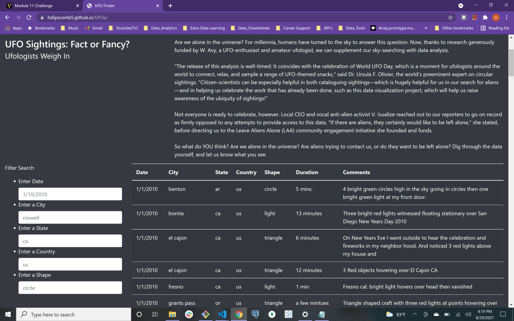
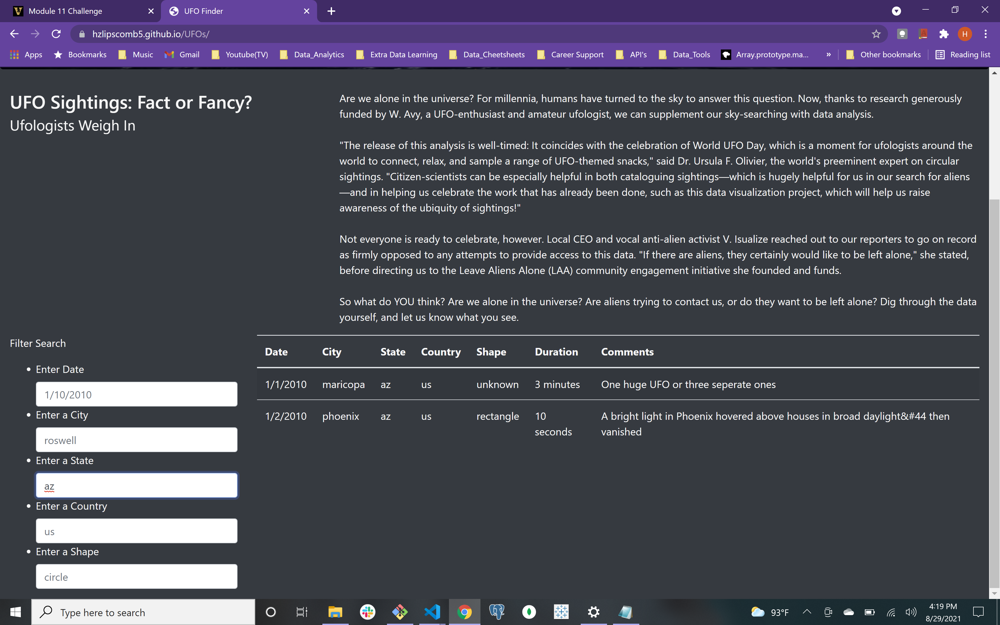
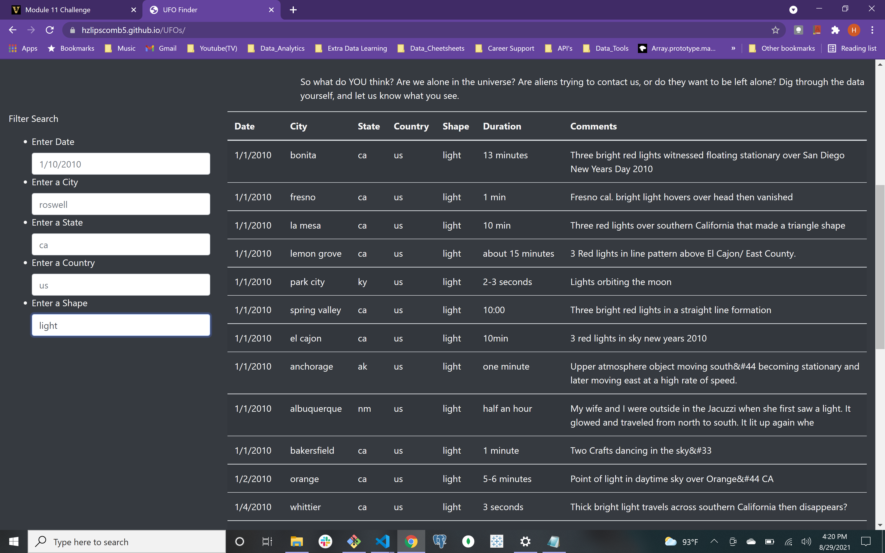

# UFOs
## Overview of the Analysis
- Our analysis was based on a dataset full of reported UFO sightings. The amount of total data was too large and unwieldly for viewing in one place. To alleviate the issue, we created a website with a table that filters the data by the properties of each object in the dataset. 

## Results
- To perform a search on the website, you simply type an applicable property value, into the given text boxes. The property id categories that the dataset is filtered by are date, city, state, country, and shape

## Summary
